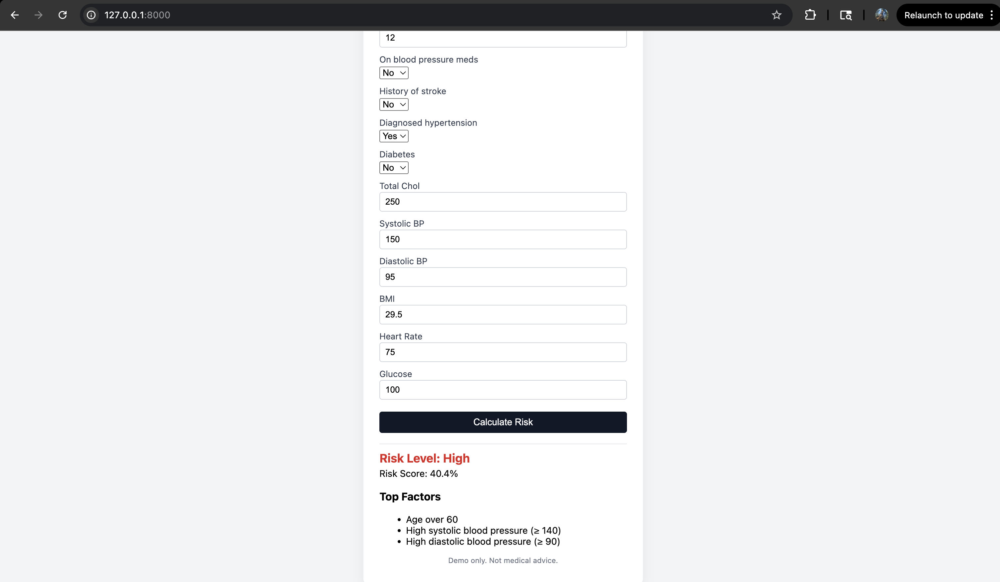
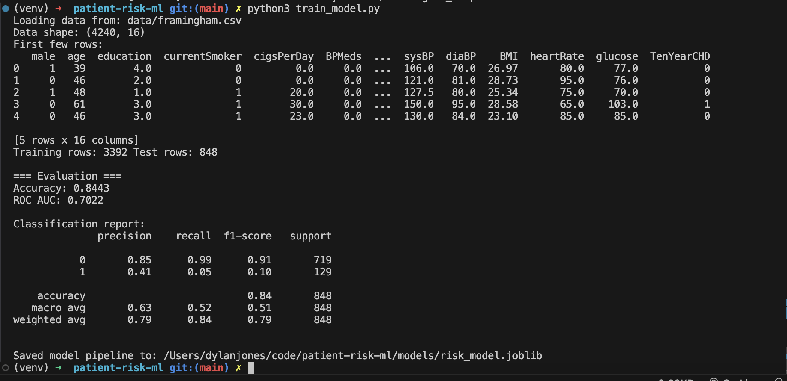

# Cardiovascular Risk Predictor (Framingham CHD) 

A small end-to-end ML project that predicts **10-year coronary heart disease (CHD) risk** from basic clinical features, using the **Framingham Heart Study** dataset.

- Trains a **logistic regression** model on real patient data
- Serves predictions via a **FastAPI** backend
- Provides a minimal browser UI for clinicians to enter patient data and see:
  - a **risk probability**
  - a **Low / Moderate / High** risk band
  - **Top contributing factors** in plain language

>  **Disclaimer**: This project is for demonstration/portfolio purposes only.  
> It is **not** a medical device and must not be used for clinical decision-making.

---

## 1. Tech Stack

**ML / Data**

- Python, pandas, scikit-learn
- LogisticRegression inside a Pipeline with SimpleImputer + StandardScaler
- joblib for model persistence

**Backend**

- FastAPI
- Pydantic models for request/response validation
- Uvicorn ASGI server

**Frontend**

- Static HTML + vanilla JavaScript
- Custom CSS (simple centered card layout) served from FastAPI `/static`

---

## 2. Dataset & Features

This project uses the **Framingham Heart Study** dataset, a cardiovascular risk dataset with a 10-year CHD outcome label (`TenYearCHD` 0/1).

### Target

- `TenYearCHD` – 1 if the patient developed coronary heart disease in the following 10 years, else 0.

### Features used

```text
male              # 1 = male, 0 = female
age               # years
education         # 1–4 (approx. some HS → college+)
currentSmoker     # 1 = yes, 0 = no
cigsPerDay        # cigarettes per day
BPMeds            # 1 = on BP meds, 0 = not
prevalentStroke   # 1 = history of stroke, 0 = no
prevalentHyp      # 1 = diagnosed hypertension, 0 = no
diabetes          # 1 = diabetes, 0 = no
totChol           # total cholesterol (mg/dL)
sysBP             # systolic blood pressure
diaBP             # diastolic blood pressure
BMI               # body mass index
heartRate         # resting heart rate
glucose           # fasting glucose
```
Missing values in these fields are handled in the pipeline with a median imputer.


## 3. Model

The model is defined and trained in `train_model.py`:

- Pipeline: `SimpleImputer(strategy="median") → StandardScaler() → LogisticRegression(max_iter=500)`
- Train/test split: 80/20 with `stratify=y` to preserve the positive/negative ratio
- Metrics:
  - Accuracy: ~0.84
  - ROC AUC: ~0.70

The entire fitted pipeline plus metadata (`feature_cols`, `target_col`) is saved to:

```text
models/risk_model.joblib
```
This file is loaded by the FastAPI app at startup.

## 4. Project Structure

```text
patient-risk-ml/
  ├─ app.py                  # FastAPI app (API + static UI)
  ├─ train_model.py          # Training script (scikit-learn pipeline)
  ├─ risk_explainer.py       # Rule-based explanation of risk factors
  ├─ data/
  │    └─ framingham.csv   # Framingham heart dataset (subset)
  ├─ models/
  │    └─ risk_model.joblib       # Saved pipeline (generated by train_model.py)
  ├─ static/
  │    ├─ index.html         # Frontend UI
  │    └─ styles.css         # Frontend styling
  ├─ requirements.txt
  └─ README.md
```

## 5. Getting Started

### 5.1. Prerequisites

- Python 3.9+ recommended  
- `pip` available  
- (Optional but recommended) `virtualenv`  

### 5.2. Create and activate a virtual environment

```bash
python3 -m venv venv
source venv/bin/activate        # macOS / Linux
# venv\Scripts\activate         # Windows PowerShell / cmd
```


## 5.3. Install dependencies

If `requirements.txt` exists:

```bash
pip install -r requirements.txt
```
If not, you can install the core packages manually:

    pip install fastapi uvicorn scikit-learn pandas numpy joblib

---

## 6. Train the Model

Make sure `data/framingham.csv` exists, then run:

    python3 train_model.py

You should see logs similar to:

    Loading data from: data/framingham.csv
    Data shape: (4240, 16)
    First few rows:
    male age education currentSmoker ...
    0    1   39   4.0           0    ...
    ...

    Training rows: 3392 Test rows: 848

    === Evaluation ===
    Accuracy: 0.8443
    ROC AUC: 0.7022
    ...
    Saved model pipeline to: .../models/risk_model.joblib

This step must be run at least once so that `models/risk_model.joblib` exists for the API.

---

## 7. Run the API + UI

Start the FastAPI app with Uvicorn:

    uvicorn app:app --reload

By default it runs at:

- http://127.0.0.1:8000/ – Frontend UI (`index.html`)
- http://127.0.0.1:8000/api/health – health check JSON
- `POST http://127.0.0.1:8000/predict` – prediction endpoint

Then open a browser to:

- http://127.0.0.1:8000/

You’ll see a centered card where you can enter:

- sex, age, education
- smoking status and cigs/day
- BP meds, stroke, hypertension, diabetes
- cholesterol, blood pressure, BMI, heart rate, glucose

Click **“Calculate Risk”** to send a request to `/predict` and display:

- Risk Level (Low / Moderate / High)
- Risk Score (0–100% probability)
- Top Factors (age, BP, BMI, etc. that pushed risk up)

---

## 8. Using the API via curl

You can also hit the API directly from the command line.

### 8.1. Example request

    curl -X POST "http://127.0.0.1:8000/predict" \
      -H "Content-Type: application/json" \
      -d '{
        "male": 1,
        "age": 61,
        "education": 3,
        "currentSmoker": 1,
        "cigsPerDay": 20,
        "BPMeds": 0,
        "prevalentStroke": 0,
        "prevalentHyp": 1,
        "diabetes": 0,
        "totChol": 250,
        "sysBP": 150,
        "diaBP": 95,
        "BMI": 29.5,
        "heartRate": 75,
        "glucose": 100
      }'

### 8.2. Example response

    {
      "risk_score": 0.448,
      "risk_level": "High",
      "top_factors": [
        "Age over 60",
        "High systolic blood pressure (≥ 140)",
        "High diastolic blood pressure (≥ 90)"
      ]
    }

`risk_score` is the probability from the logistic regression model (`predict_proba`).

`risk_level` is a simple banding:

- `< 0.10` → Low  
- `0.10 – 0.20` → Moderate  
- `> 0.20` → High  

`top_factors` come from `risk_explainer.py` (see below).

---

## 9. Explainability: `risk_explainer.py`

The risk model is a standard logistic regression, which already has interpretable coefficients, but for demo purposes the app also provides rule-based explanations.

`risk_explainer.py` inspects the raw inputs and returns human-readable reasons, for example:

- Age over 60
- High systolic blood pressure (≥ 140)
- BMI in obese range (≥ 30)
- Current smoker
- Diabetes
- High total cholesterol (≥ 240)
- Elevated fasting glucose (≥ 126)

Only the top 3 reasons are returned to keep the UI compact.


---

## 10. Design Notes 

### Problem framing

Predict 10-year CHD risk from basic clinical features (age, sex, BP, smoking, etc.), a classic cardiovascular risk problem.

### Dataset choice

Used a real, well-known clinical dataset (Framingham) instead of synthetic data so metrics and feature importances have meaningful clinical interpretations.

### Model choice

Logistic regression is:

- fast to train
- robust for tabular data
- widely used in clinical risk scores
- easy to explain (odds ratios)

### Pipeline

Encapsulated preprocessing and model in a single scikit-learn Pipeline with:

- median imputation for missing numeric values
- standardization for better optimization
- logistic regression as the final estimator

### Evaluation

Used accuracy and ROC AUC, with a held-out 20% test set and stratified split due to class imbalance.

### Serving

Wrapped the trained model in a FastAPI service with a typed request model (`PatientInput`) and response model (`RiskOutput`), then added a small HTML/JS UI to demonstrate real-time predictions.

### Explainability

Implemented `risk_explainer.py` to map raw features to understandable risk drivers, which appear right under the risk score in the UI.

---

## 11. Limitations & Ethics

- Trained on a specific cohort (Framingham), which may not generalize to other populations.
- No calibration step is applied; probabilities are raw logistic regression outputs on the held-out split.
- No clinical validation; this is a technical demo only.
- Not audited for bias or fairness across demographic subgroups.
- Do not use this code or model for real medical decisions.

---

## 12. Possible Extensions

Ideas for future iterations:

- Add probability calibration (e.g., Platt scaling or isotonic regression).
- Try tree-based models (RandomForest, XGBoost) and compare ROC AUC / PR curves.
- Add a model comparison page in the UI.
- Persist prediction logs for later analysis.
- Containerize with Docker and deploy to a cloud platform (Fly.io, Render, etc.).
- Add authentication and multi-user support if used in a sandbox environment.

---

## 13. Running Summary

Quick recap to run everything:

1. Setup

    python3 -m venv venv  
    source venv/bin/activate  
    pip install -r requirements.txt   # or install deps manually  

2. Train model

    python3 train_model.py  

3. Start API + UI

    uvicorn app:app --reload  

4. Open UI

- In browser:  
  - http://127.0.0.1:8000/

5. (Optional) Test via curl

    curl -X POST http://127.0.0.1:8000/predict ...

## 14. Screenshots


```
when you run python3 train_model.py 
```



